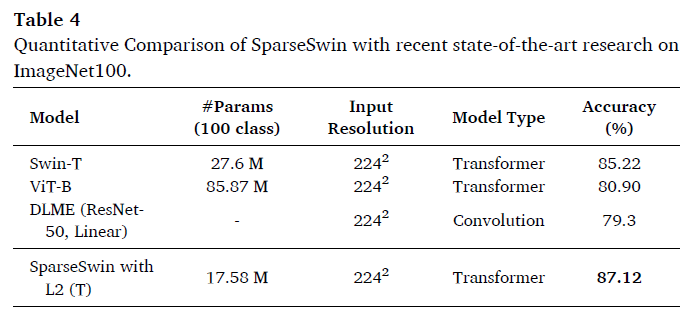
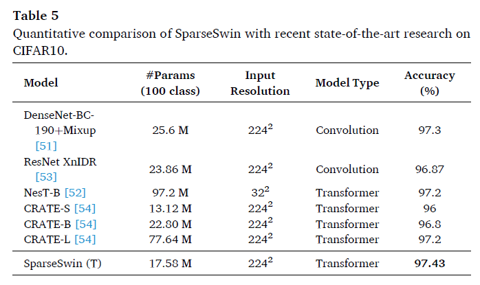
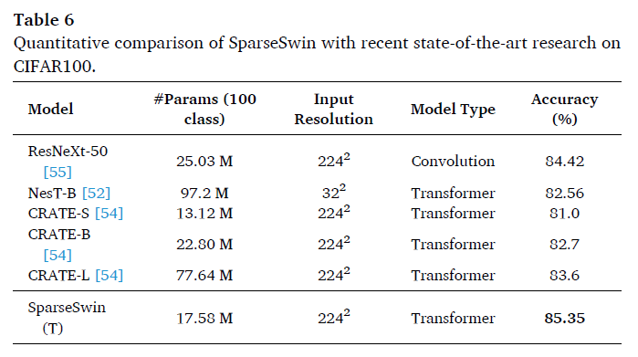

# SparseSwin

---

This repo is the official implementation of <a href="https://doi.org/10.1016/j.neucom.2024.127433">SparseSwin: Swin Transformer with Sparse Transformer Block </a>.  

## Abstract

Advancements in computer vision research have put transformer architecture as the state-of-the-art in computer
vision tasks. One of the known drawbacks of the transformer architecture is the high number of parameters, this
can lead to a more complex and inefficient algorithm. This paper aims to reduce the number of parameters and in
turn, made the transformer more efficient. We present Sparse Transformer (SparTa) Block, a modified transformer
block with an addition of a sparse token converter that reduces the dimension of high-level features to the
number of latent tokens. We implemented the SparTa Block within the Swin-T architecture (SparseSwin) to
leverage Swin’s proficiency in extracting low-level features and enhance its capability to extract information
from high-level features while reducing the number of parameters. The proposed SparseSwin model outperforms
other state-of-the-art models in image classification with an accuracy of 87.26%, 97.43%, and 85.35% on the
ImageNet100, CIFAR10, and CIFAR100 datasets respectively. Despite its fewer parameters, the result highlights
the potential of a transformer architecture using a sparse token converter with a limited number of tokens to
optimize the use of the transformer and improve its performance.

## Information

<The>SparseSwin is an architecture designed for addressing image classification cases, but it is not limited to <a href="SparseSwinDet/"> object detection </a> and <a href="SparseSwinDense/"> image segmentation</a> scenarios. SparseSwin is constructed by employing the Swin Transformer as the primary architecture, implementing our proposed Sparse Transformer (SparTa) Block in the fourth stage.The SparTa Block possesses computational complexity unrelated to the size of the input image, allowing it to efficiently handle large input image sizes.

In detail, the architecture used in this research is illustrated in Figures 1 and 2.

<figure>
    

        
        <figcaption><b>Fig. 1</b> The architecture of SparseSwin</figcaption>
    

</figure>

<figure>
    

        
        <figcaption><b>Fig. 2</b> The successive SparTa blocks in stage 4 of SparseSwin for image classification</figcaption>
    

</figure>

<figure>
    

        
        <figcaption><b>Fig. 3</b> Graph Comparison of computational complexity between Swin Transformer Block and our proposed SparTa Block assuming the input image is a square so that the height and width of the features have the same value. In this figure, the x-axis represents the height and width of the input features in block 4 of the Swin Transformer and SparseSwin architectures while the y-axis represents the computational complexity of the attention calculation.</figcaption>
    

</figure>

Through this research, we obtained accuracy improvements on several transformer architectures with similar parameter sizes on benchmark datasets such as ImageNet100, CIFAR10, and CIFAR100. 

<figure>
    
    
    
</figure>

## References

    Pinasthika, K., Laksono, B.S.P., Irsal, R.B.P. and Yudistira, N., 2024. SparseSwin: Swin Transformer with Sparse Transformer Block. Neurocomputing, p.127433.

## Citation

    @article{PINASTHIKA2024127433,
        title = {SparseSwin: Swin transformer with sparse transformer block},
        journal = {Neurocomputing},
        volume = {580},
        pages = {127433},
        year = {2024},
        issn = {0925-2312},
        doi = {https://doi.org/10.1016/j.neucom.2024.127433},
        url = {https://www.sciencedirect.com/science/article/pii/S0925231224002042},
        author = {Krisna Pinasthika and Blessius Sheldo Putra Laksono and Riyandi Banovbi Putera Irsal and Syifa’ Hukma Shabiyya and Novanto Yudistira},
        keywords = {CIFAR10, CIFAR100, Computer vision, Image classification, ImageNet100, Transformer},
        abstract = {Advancements in computer vision research have put transformer architecture as the state-of-the-art in computer vision tasks. One of the known drawbacks of the transformer architecture is the high number of parameters, this can lead to a more complex and inefficient algorithm. This paper aims to reduce the number of parameters and in turn, made the transformer more efficient. We present Sparse Transformer (SparTa) Block, a modified transformer block with an addition of a sparse token converter that reduces the dimension of high-level features to the number of latent tokens. We implemented the SparTa Block within the Swin-T architecture (SparseSwin) to leverage Swin's proficiency in extracting low-level features and enhance its capability to extract information from high-level features while reducing the number of parameters. The proposed SparseSwin model outperforms other state-of-the-art models in image classification with an accuracy of 87.26%, 97.43%, and 85.35% on the ImageNet100, CIFAR10, and CIFAR100 datasets respectively. Despite its fewer parameters, the result highlights the potential of a transformer architecture using a sparse token converter with a limited number of tokens to optimize the use of the transformer and improve its performance. The code is available at https://github.com/KrisnaPinasthika/SparseSwin.}
    }
